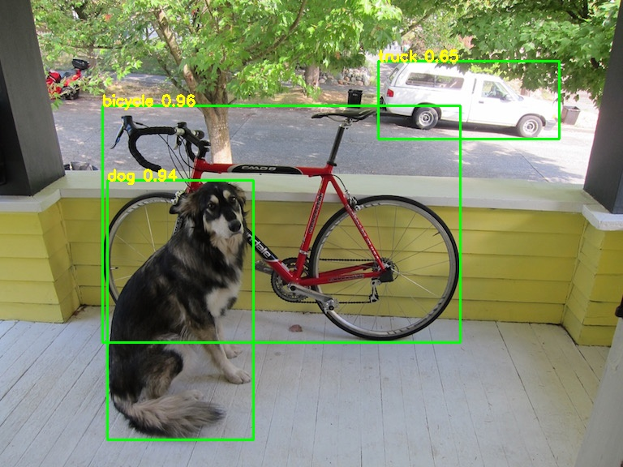
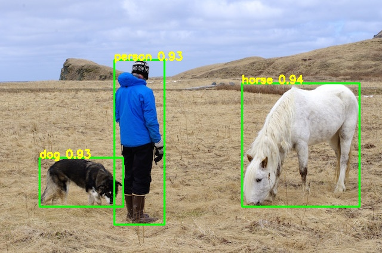
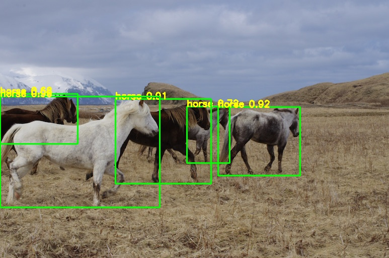
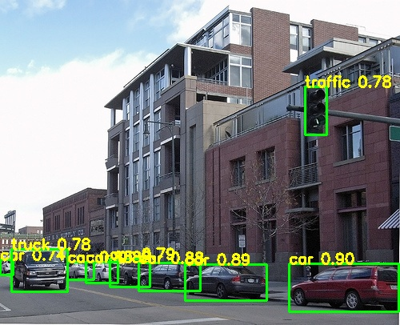

# YOLOV7_AnchorFree_PyTorch
yolov7's anchor free model to pytorch

## Demo
     
   

## 中文解读
传送门

## Model
[yolov7-u6-samylee.pt](https://pan.baidu.com/s/11xl6V5zcSvBxC9W2-im2eA), 提取码8888

## Reference
https://github.com/WongKinYiu/yolov7  
https://blog.csdn.net/samylee  
